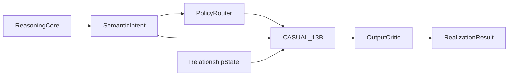

# CASUAL PRODUCTION INTEGRATION v0.1

**Model:** MAGI-CASUAL 13.789B dense  
**Config:** [`configs/casual_serving_profiles_v0.1.yaml`](../configs/casual_serving_profiles_v0.1.yaml)  
**Architecture truth:** [`docs/MAGI_CASUAL_LLM_ARCHITECTURE_SPEC_v0.1.md`](MAGI_CASUAL_LLM_ARCHITECTURE_SPEC_v0.1.md)

---

## 1. Boundary

CASUAL is the language realization subsystem. It does not reason, invent facts, correct numbers, or bypass hard policy.

---

## 2. Serving Profiles

| Profile | GPUs | Role |
|---------|-----:|------|
| casual_single_b300 | 1 | low-concurrency integration |
| casual_tp2_b300 | 2 | latency margin |
| casual_pool_8xb300 | 8 | production pool |

Weights BF16 estimate: `13.789B × 2 ≈ 27.58GB`; FP8 estimate: `≈13.79GB` before runtime overhead.

---

## 3. Inputs And Outputs

Inputs:

- semantic intent;
- reasoning summary;
- policy state;
- relationship state;
- conversation state;
- presentation state.

Output:

- realization text;
- selected register;
- critic pass;
- optional dev metadata.

---

## 4. CASUAL-30B / CASUAL-MoE Gate

Default remains dense 13.789B. Larger CASUAL is only allowed if measured eval proves failure in:

- semantic retention;
- RU naturalness;
- register control;
- policy adherence;
- long-conversation continuity.

CASUAL-MoE is not a default. It is a v0.2 research branch only after failure evidence.

---

## 5. Production Gates

| Gate | Required |
|------|----------|
| semantic preservation | pass |
| anti-sycophancy | pass |
| profanity control | no collapse |
| Founder protocol | Vy + respect + no fact sellout |
| HR hard mask | above Chaos |
| latency | measured, no fake SLA |

---

## 6. v0.1 FREEZE

| Decision | Value |
|----------|-------|
| Production CASUAL | 13.789B dense |
| Critic | shared head, max regen 2 |
| CASUAL-MoE | rejected until eval failure |
| Reasoning mutation | forbidden |
