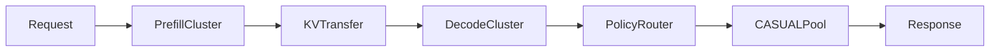

# INFERENCE SERVING ARCHITECTURE v0.1

**Program:** MAGI-5.5GTBS  
**Profiles:** [`configs/serving_profiles_v0.1.yaml`](../configs/serving_profiles_v0.1.yaml)  
**Scope:** serving architecture; no deployment performed.

---

## 1. Runtime Topology



Reasoning serving and CASUAL serving are separate pools.

---

## 2. Engine Strategy

| Engine | Role | Required features |
|--------|------|-------------------|
| vLLM | broad compatibility default | Expert Parallel, DP Attention, FP8 KV, prefill/decode split |
| SGLang | prefix-heavy multi-turn candidate | MoE EP, RadixAttention, structured outputs |

No external LLM API is allowed as runtime cognition.

---

## 3. KV Cache Formula

```
KV_bytes = 2 · n_layers · n_kv_heads · d_head · sequence_length · batch · bytes_per_element
```

GQA cache scales with `n_kv_heads`, not `n_heads`.

| Model | Context | BF16 KV / sequence | FP8 KV / sequence | Class |
|-------|--------:|-------------------:|------------------:|-------|
| MAGI-35B | 65,536 | ~12.88GB | ~6.44GB | CALCULATED |
| MAGI-400B | 131,072 | ~34.36GB | ~17.18GB | CALCULATED |

Long context serving is KV-bound before it is weight-bound.

---

## 4. Model Weight Serving Pressure

| Model | Total params | BF16 weights | FP8 weights approx | Notes |
|-------|-------------:|-------------:|-------------------:|-------|
| MAGI-35B | 34.055B | ~68.11GB | ~34.05GB | fits one B300, but throughput needs parallelism |
| MAGI-400B | 406.626B | ~813.25GB | ~406.63GB | fits across B300 node memory, but production needs EP/DP |
| CASUAL | 13.789B | ~27.58GB | ~13.79GB | separate realization pool |

Weights fitting is not sufficient for production latency.

---

## 5. vLLM Path

Target behavior:

- `--enable-expert-parallel`;
- tensor parallel for dense/attention blocks;
- DP Attention for KV partitioning;
- `--kv-cache-dtype fp8`;
- prefill/decode disaggregation for long context.

vLLM is the default compatibility path.

---

## 6. SGLang Path

Target behavior:

- `--enable-moe-ep`;
- RadixAttention for prefix reuse;
- prefill/decode split;
- structured output channel for dev metadata.

SGLang is selected for prefix-heavy agentic traffic if benchmarks beat vLLM on the MAGI workload.

---

## 7. Serving Gates

| Gate | Required proof |
|------|----------------|
| KV pressure | no OOM at target context/batch |
| EP routing | stable dispatch latency |
| prefill/decode | no KV transfer bottleneck |
| CASUAL handoff | semantic pins preserved |
| policy hard masks | HR above Chaos |
| fallback | degraded mode works |

---

## 8. v0.1 FREEZE

| Decision | Value |
|----------|-------|
| Default engine | vLLM |
| Prefix-heavy candidate | SGLang |
| KV dtype target | FP8 |
| External API cognition | forbidden |
| CASUAL separate pool | yes |
