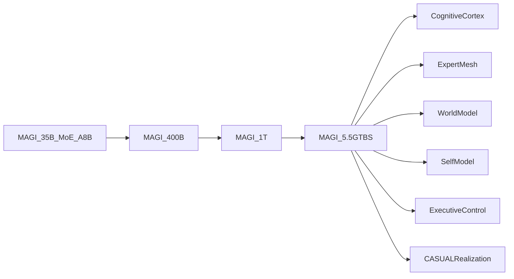

# MAGI-5.5GTBS MASTER ARCHITECTURE SPEC v0.2

**Final monster:** MAGI-5.5GTBS  
**Config SoT:** [`configs/magi_5_5gtbs_architecture_envelope_v0.2.yaml`](../configs/magi_5_5gtbs_architecture_envelope_v0.2.yaml)  
**Baseline truth preserved:** MAGI-400B v0.1 and MAGI-CASUAL v0.1  
**From-zero:** YES. No pretrained backbone. No API cognition.

---

## 1. Purpose

This document defines the production architecture envelope after Phase 0–1. It does not replace MAGI-400B; it places MAGI-35B and MAGI-400B inside the path to the final 5.5T system.



---

## 2. Active Compute Law

| Field | Value | Class |
|-------|------:|-------|
| Total target | 5,500,000,000,000 | HYPOTHESIS target |
| Active / cognitive cycle min | 45,000,000,000 | HYPOTHESIS |
| Active / cognitive cycle max | 90,000,000,000 | HYPOTHESIS |
| First trainable gate | MAGI-35B-MoE-A8B | CALCULATED child |
| Baseline monster | MAGI-400B | CALCULATED child |

The strategy is to grow total capacity via hierarchical sparse experts while keeping active cycle compute bounded.

---

## 3. Subsystem Envelope

| Subsystem | Target params | Share | Role | Class |
|-----------|--------------:|------:|------|-------|
| Cognitive cortex | 1.54T | 0.28 | recurrent decoder MoE cortex | HYPOTHESIS |
| Specialist expert mesh | 2.31T | 0.42 | hierarchical expert capacity | HYPOTHESIS |
| World model | 440B | 0.08 | state transition prediction | HYPOTHESIS |
| Social / ToM | 220B | 0.04 | agent/social uncertainty | HYPOTHESIS |
| Self model | 165B | 0.03 | computational self-state | HYPOTHESIS |
| Counterfactual system | 165B | 0.03 | alternate trajectories | HYPOTHESIS |
| Multimodal system | 330B | 0.06 | later grounding | HYPOTHESIS |
| Executive control | 220B | 0.04 | arbitration / compute budget | HYPOTHESIS |
| Synthetic drives | 110B | 0.02 | bounded internal controls | HYPOTHESIS |

These shares are not measured results. They are v0.2 allocation envelopes subject to 35B/400B/1T falsification.

---

## 4. Routing Hierarchy

```
runtime_state
  → state_router
  → domain_router
  → cognitive_router
  → expert_family_router
  → specialist_expert_router
```

Required metrics: utilization, entropy, dead experts, route stability, inter-family redundancy, all-to-all pressure.

Hard constraints remain outside routing dynamics. Policy/Chaos cannot bypass safety or semantic pins.

---

## 5. Recurrent Cognition Contract

```
PERCEIVE
→ UPDATE_WORLD_STATE
→ RETRIEVE_MEMORY
→ GENERATE_INTERNAL_STATE
→ ROUTE_EXPERTS
→ SIMULATE
→ CRITIQUE
→ UPDATE
→ ACT_OR_REPEAT
```

This is runtime state, not hidden prompt text. Each cycle has an explicit compute budget and termination reason: answer, think again, retrieve, simulate, use tool, act, ask, wait, refuse, reconsider.

---

## 6. Memory Interfaces

| Interface | Role | Write policy required | Weight overwrite |
|-----------|------|-----------------------|------------------|
| M0 | working state | every cycle | forbidden |
| M1 | episodic | event-gated | forbidden |
| M2 | semantic | consolidation-gated | forbidden |
| M3 | autobiographical | identity/history-gated | forbidden |
| M4 | relationship | relationship event-gated | forbidden |
| M5 | procedural | skill outcome-gated | forbidden |
| M6 | salience/affective | bounded salience-gated | forbidden |
| M7 | counterfactual | simulation-gated | forbidden |

Every memory record must carry provenance, confidence, temporal ordering, and conflict policy.

---

## 7. World And Self Model

World model contract:

```
STATE_t + ACTION_t → predicted STATE_t+1
```

Self model contract:

```
SELF(t+1) = f(SELF(t), experience, memory, actions, consequences)
```

This is a computational self-model. No consciousness claim is allowed.

---

## 8. CASUAL Boundary

CASUAL remains outside the 5.5T reasoning weight budget. It receives semantic intent and policy/relationship state, then realizes language. It cannot alter facts, numbers, or hard safety decisions.

Current production candidate: **MAGI-CASUAL 13.789B dense**.

---

## 9. Promotion Gates

| Gate | Required proof |
|------|----------------|
| 35B → 400B | MoE stable, tokenizer passes, checkpoint reshard, all-to-all viable |
| 400B → 1T | expert specialization measured, routing stable, serving pressure understood |
| 1T → 5.5T | subsystem allocations measured, recurrent runtime validated, memory/world/self contracts stable |

---

## 10. Rejected Paths

- starting the program with 1B/7B as model ladder;
- using a pretrained backbone;
- calling external LLM APIs as cognition;
- freezing 5.5T subsystem shares before measurement;
- turning CASUAL into the reasoning core;
- claiming AGI or consciousness.

---

## 11. v0.2 FREEZE

| Decision | Value |
|----------|-------|
| Final target | MAGI-5.5GTBS |
| Total target | 5.5T |
| Active cycle | 45–90B |
| First trainable gate | MAGI-35B-MoE-A8B |
| Baseline gate | MAGI-400B |
| CASUAL role | realization only |
| Pretrained weights | forbidden |
