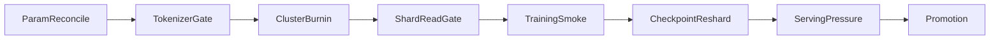

# OBSERVABILITY AND GATES v0.1

**Program:** MAGI-5.5GTBS  
**Config:** [`configs/gate_thresholds_v0.1.yaml`](../configs/gate_thresholds_v0.1.yaml)

---

## 1. Principle

No expensive run proceeds without gates. No number is reported as measured unless it was measured.

---

## 2. Gate Stack

---

## 3. Required Training Telemetry

| Metric | Purpose |
|--------|---------|
| loss | convergence |
| grad_norm | instability |
| nan_rate | stop rule |
| tokens_per_second | throughput |
| mfu | hardware efficiency |
| router_entropy | route health |
| tokens_per_expert | expert balance |
| expert_utilization | dead expert detection |
| all_to_all_ms | MoE bottleneck |
| checkpoint_save_s | storage pressure |
| dataloader_wait_ms | input starvation |

---

## 4. Initial Stop Conditions

| Gate | Threshold |
|------|-----------|
| sustained NaN | 0 tolerated |
| dead expert fraction | >10% blocks promotion |
| top expert token share | >40% blocks promotion |
| checkpoint save/load | mandatory |
| checkpoint reshard | mandatory |
| KV OOM | forbidden |

Thresholds are v0.1 engineering seeds; production thresholds require measured history.

---

## 5. CASUAL Gates

| Gate | Meaning |
|------|---------|
| semantic retention | CASUAL does not mutate facts |
| anti-sycophancy | Founder can be wrong |
| profanity collapse | high Chaos does not spam profanity |
| HR over Chaos | hard constraints win |
| register control | state-causal style |

---

## 6. Promotion Gates

| Promotion | Required |
|-----------|----------|
| 35B → 400B | params, tokenizer, MoE, all-to-all, checkpoint |
| 400B → 1T | expert specialization, serving pressure, loss/routing |
| 1T → 5.5T | subsystem allocation, recurrent runtime, memory/world/self |

---

## 7. v0.1 FREEZE

| Decision | Value |
|----------|-------|
| Fake metrics | forbidden |
| Bad-node quarantine | mandatory |
| Expert collapse stop | mandatory |
| Checkpoint reshard | mandatory |
